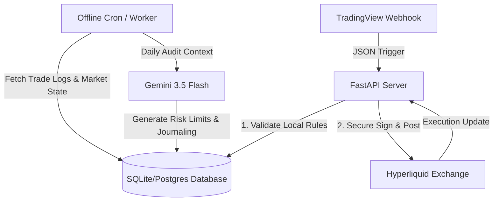

# Technical Design: Hyperliquid Commercial SaaS Trading Bot

## Architecture Overview

A high-performance FastAPI backend orchestrates execution between TradingView webhooks and the Hyperliquid exchange, while an offline asynchronous process uses Gemini 3.5 Flash for trade journaling, risk analysis, and metric generation.



---

## 1. Database Schema Design (SQLite / Postgres)

### `users`
- `id` (INTEGER PRIMARY KEY)
- `email` (TEXT UNIQUE)
- `hl_wallet` (TEXT) - Hyperliquid wallet address
- `hl_api_key` (TEXT) - Custom agent API key for executing trades
- `hl_api_secret` (TEXT) - Encrypted secret key
- `risk_multiplier` (REAL, default: 1.0)
- `max_leverage` (INTEGER, default: 10)
- `is_active` (BOOLEAN, default: TRUE)
- `created_at` (TEXT)

### `strategy_configs`
- `user_id` (INTEGER, FOREIGN KEY)
- `symbol` (TEXT) - e.g., "BTC-PERP"
- `active` (BOOLEAN)
- `size_pct_per_trade` (REAL) - % of balance per position
- `hard_stop_loss_pct` (REAL)
- `hard_take_profit_pct` (REAL)

### `client_positions`
- `id` (INTEGER PRIMARY KEY)
- `user_id` (INTEGER, FOREIGN KEY)
- `symbol` (TEXT)
- `side` (TEXT) - LONG/SHORT
- `size` (REAL)
- `entry_price` (REAL)
- `leverage` (REAL)
- `margin` (REAL)
- `tp_price` (REAL)
- `sl_price` (REAL)
- `updated_at` (TEXT)

### `client_trades`
- `id` (INTEGER PRIMARY KEY)
- `user_id` (INTEGER, FOREIGN KEY)
- `symbol` (TEXT)
- `side` (TEXT)
- `price` (REAL)
- `size` (REAL)
- `pnl` (REAL)
- `trigger_type` (TEXT) - TV_SIGNAL / SL / TP / MANUAL
- `timestamp` (TEXT)

### `risk_audits` (AI Generated)
- `id` (INTEGER PRIMARY KEY)
- `timestamp` (TEXT)
- `audit_report` (TEXT) - Gemini structured assessment
- `suggested_leverage_limit` (INTEGER)
- `daily_volatility_multiplier` (REAL)

---

## 2. API Endpoint Structure (FastAPI)

- `POST /api/webhook/tradingview`
  - Gated by custom token/API Key.
  - Fast execution: processes payload, retrieves user configuration, submits signed trade request to Hyperliquid API.
  
- `POST /api/trades/close`
  - Close specific open position.
  
- `GET /api/dashboard`
  - Get active positions, trade metrics, and Gemini-generated journals.

- `POST /api/user/config`
  - Edit user's leverage settings, risk parameters, and API keys.

---

## 3. Webhook Execution Flow (Low Latency)

```python
@app.post("/api/webhook/tradingview")
async def handle_tradingview_webhook(payload: WebhookPayload, api_key: str = Depends(verify_webhook_token)):
    # 1. Fetch user strategy configuration from DB
    config = await db.get_active_configs_for_webhook(payload.symbol)
    
    # 2. Parallel loop over user accounts to order
    for user_cfg in config:
        # 3. Formulate order
        order_payload = construct_hyperliquid_order(
            wallet=user_cfg.hl_wallet,
            symbol=payload.symbol,
            side=payload.side,
            size=payload.size,
            price=payload.price
        )
        
        # 4. Sign and execute (using Hyperliquid API directly or via SDK)
        # Avoid blocking - execute asynchronously
        asyncio.create_task(execute_hyperliquid_order(user_cfg, order_payload))
        
    return {"status": "processing"}
```

---

## 4. AI-Driven Offline Risk & Journaling (Gemini 3.5 Flash)

Every hour/day:
1. Gather trade history for the period (`client_trades`).
2. Gather volatility / market indicators.
3. Pass summary to Gemini 3.5 Flash:
   ```python
   prompt = f"Analyze trades {trades} under market condition {conditions}. Outline risk leaks and construct a trade journal entry."
   ```
4. Save structured journal feedback and dynamically override `daily_volatility_multiplier` or adjust strategy params in DB.
