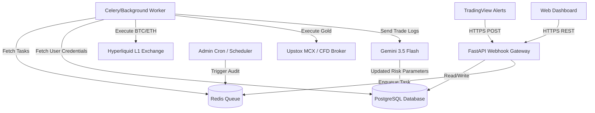

# Technical Architecture: Multi-Asset Commercial SaaS Trading Platform (Gold, BTC, ETH)

This document describes the production system architecture, database layout, bot execution engine, security model, and deployment strategy for the multi-asset commercial trading SaaS.

## 1. System Topology

The platform consists of a modular FastAPI gateway, a PostgreSQL database, an async task queue (Redis + Celery/Workers) for off-chain execution/AI processing, and a frontend dashboard.



---

## 2. Multi-Asset Execution Engine Design

To handle diverse asset classes, the system implements a unified Execution Adapter pattern:

- **Crypto (BTC, ETH):** Routed through `HyperliquidExecutor`. Runs EIP-712 cryptographic signature generation and direct API order submission.
- **Gold (XAU/USD, MCX Gold Futures):** Routed through `BrokerExecutor` (e.g. Upstox MCX or OANDA CFD). Requires market-hours check (e.g., MCX weekday trading hours) and standard OAuth API authentication.

---

## 3. Database Schema Specification (PostgreSQL-compatible)

```sql
-- Enums for Tiers and Roles
CREATE TYPE user_role AS ENUM ('admin', 'user');
CREATE TYPE subscription_tier AS ENUM ('free', 'pro', 'enterprise');
CREATE TYPE asset_class AS ENUM ('crypto', 'commodity');
CREATE TYPE trade_side AS ENUM ('LONG', 'SHORT');

-- Users Table
CREATE TABLE users (
    id SERIAL PRIMARY KEY,
    email VARCHAR(255) UNIQUE NOT NULL,
    password_hash VARCHAR(255) NOT NULL,
    role user_role DEFAULT 'user',
    tier subscription_tier DEFAULT 'free',
    is_active BOOLEAN DEFAULT TRUE,
    created_at TIMESTAMP WITH TIME ZONE DEFAULT CURRENT_TIMESTAMP
);

-- Secure Exchange Credentials
CREATE TABLE user_credentials (
    id SERIAL PRIMARY KEY,
    user_id INT REFERENCES users(id) ON DELETE CASCADE,
    broker_name VARCHAR(50) NOT NULL, -- 'hyperliquid', 'upstox', 'oanda'
    api_key VARCHAR(255) NOT NULL,
    api_secret_encrypted TEXT NOT NULL, -- AES encrypted
    wallet_address VARCHAR(255), -- Optional, for crypto
    created_at TIMESTAMP WITH TIME ZONE DEFAULT CURRENT_TIMESTAMP
);

-- Strategy Configs
CREATE TABLE strategy_configs (
    id SERIAL PRIMARY KEY,
    user_id INT REFERENCES users(id) ON DELETE CASCADE,
    symbol VARCHAR(50) NOT NULL, -- 'BTC-PERP', 'ETH-PERP', 'GOLD-MCX'
    asset_type asset_class NOT NULL,
    active BOOLEAN DEFAULT TRUE,
    leverage INT DEFAULT 10,
    size_pct_per_trade NUMERIC(5, 2) DEFAULT 5.00,
    stop_loss_pct NUMERIC(5, 2) DEFAULT 2.00,
    take_profit_pct NUMERIC(5, 2) DEFAULT 6.00,
    UNIQUE (user_id, symbol)
);

-- Active Positions Tracking
CREATE TABLE active_positions (
    id SERIAL PRIMARY KEY,
    user_id INT REFERENCES users(id) ON DELETE CASCADE,
    symbol VARCHAR(50) NOT NULL,
    side trade_side NOT NULL,
    size NUMERIC(18, 8) NOT NULL,
    entry_price NUMERIC(18, 4) NOT NULL,
    leverage INT NOT NULL,
    margin NUMERIC(18, 4) NOT NULL,
    tp_price NUMERIC(18, 4),
    sl_price NUMERIC(18, 4),
    updated_at TIMESTAMP WITH TIME ZONE DEFAULT CURRENT_TIMESTAMP,
    UNIQUE (user_id, symbol, side)
);

-- Trade Execution Logs
CREATE TABLE trade_logs (
    id SERIAL PRIMARY KEY,
    user_id INT REFERENCES users(id) ON DELETE CASCADE,
    symbol VARCHAR(50) NOT NULL,
    side trade_side NOT NULL,
    price NUMERIC(18, 4) NOT NULL,
    size NUMERIC(18, 8) NOT NULL,
    pnl NUMERIC(18, 4) DEFAULT 0.0000,
    trigger_type VARCHAR(50) NOT NULL, -- 'TV_SIGNAL', 'STOP_LOSS', 'TAKE_PROFIT'
    timestamp TIMESTAMP WITH TIME ZONE DEFAULT CURRENT_TIMESTAMP
);

-- AI Risk Audits
CREATE TABLE risk_audits (
    id SERIAL PRIMARY KEY,
    timestamp TIMESTAMP WITH TIME ZONE DEFAULT CURRENT_TIMESTAMP,
    audit_report TEXT NOT NULL,
    suggested_leverage_limit INT NOT NULL,
    daily_volatility_multiplier NUMERIC(4, 2) DEFAULT 1.00
);
```

---

## 4. Security Framework & Key Custody

- **Encryption at Rest:** User API secrets are encrypted using AES-GCM (via Python's `cryptography` package) before insertion. The encryption key (`SaaS_ENCRYPTION_KEY`) is stored inside environment variables.
- **API Security:** All webhook routes require signature verification/webhook secret token validation. Dashboards use JWT tokens for user authentication.
- **Leverage Ceiling Guard:** Users are bounded by maximum leverages enforced by the AI Compliance engine, overwriting manual user strategy leverages if volatility surges.

---

## 5. Deployment Architecture

- **Containerization:** Orchestrated via `docker-compose`. 
  - `web`: FastAPI backend serving the gateway and frontend dashboard.
  - `celery_worker`: Background process executor handling trades asynchronously.
  - `redis`: Shared cache/broker for Celery.
  - `db`: Production PostgreSQL service.
- **Uptime Monitoring:** Systemd service configurations route errors directly to standard journal logs for quick diagnostics.
