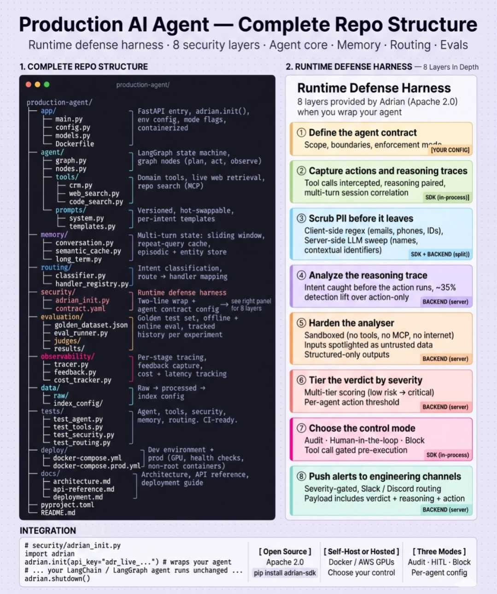

# {{AGENT_NAME}} — Production AI Agent

This repository contains **{{AGENT_NAME}}**, a production-grade autonomous AI Agent structured with modular core components, memory caching, intent routing, and an **8-layer Runtime Defense Harness** for safety, alignment, and data exfiltration protection.



---

## 🏗️ Repository Architecture

- **`app/`**: API gateway entrypoint built on FastAPI. Handles environments, mode flags, and wraps agent initialization.
- **`agent/`**: Logic core. LangGraph state machine orchestrating `plan` ➔ `act` ➔ `observe` loops, prompts, and tools.
- **`memory/`**: Advanced context retention utilizing a sliding window, semantic embeddings caching, and episodic/entity database stores.
- **`routing/`**: High-performance semantic classifier which routes inbound intents to their registered processing handlers.
- **`security/`**: Runtime security harness (`adrian_init.py`) and safety rules (`contract.yaml`).
- **`evaluation/`**: Golden test sets, offline runner, and LLM-as-a-judge evaluation frameworks.
- **`observability/`**: Trace collectors, feedback capturing mechanisms, and precise cost + latency trackers.
- **`deploy/`**: Container setups (Dockerfiles and production-ready `docker-compose` orchestration).

---

## 🔒 Runtime Defense Harness (The 8 Security Layers)

This agent leverages a runtime defense wrapper initialized in `app/main.py` via `security/adrian_init.py`. It enforces strict boundaries:

1. **Define Agent Contract**: Configures operational boundaries, tool capabilities, and safety policies via `security/contract.yaml`.
2. **Reasoning & Action Capture**: Intercepts thoughts, tool execution requests, and matches them to session states.
3. **Scrub PII**: Cleans outbound data of credit cards, PII, API tokens, and contextual identifiers using local regex and LLM cleanups.
4. **Reasoning Trace Analysis**: Pre-execution intent analysis yields ~35% safety lift before actions execute.
5. **Analyzer Hardening**: Runs analysis of user inputs in an isolated, sandboxed environment without internet/MCP access.
6. **Verdict Tiering**: Classifies potential threats into low, medium, high, and critical levels.
7. **Control Mode Gating**: Selects policy response modes: `Audit` (log-only), `HITL` (human-in-the-loop approval), or `Block` (terminate).
8. **Engineering Alerts**: Broadcasts severity-gated warnings containing full logs and decision reasoning to Slack or Discord.

---

## 🚀 Getting Started

### 1. Installation
Install core packages:
```bash
pip install -e .
```

### 2. Configure Environment
Copy `.env.example` to `.env` and set your api keys:
```bash
cp .env.example .env
```

### 3. Run FastAPI server
```bash
python app/main.py
```
Visit http://localhost:8000/docs for the swagger API specs.

### 4. Running the Evaluation Suite
```bash
python evaluation/eval_runner.py
```

### 5. Running Tests
```bash
python -m unittest discover -s tests
```
